# 当前 Demo 脚本流程图

> 这份图只描述**目前已经实现进游戏的脚本结构**，不是最终叙事设计稿。  
> 现在的实现更像“专注循环主干 + 少量关系推进节点 + 若干侧支”，真正的长线主线还很薄。

## 1. 总览：当前脚本到底由什么组成

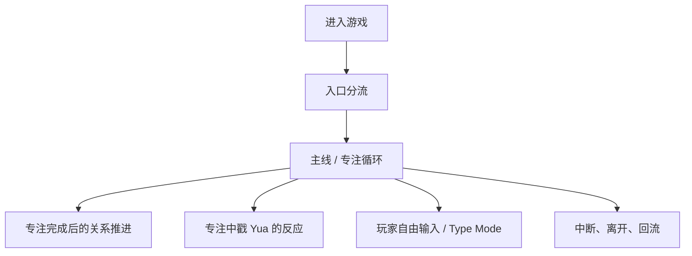

## 2. 入口分流

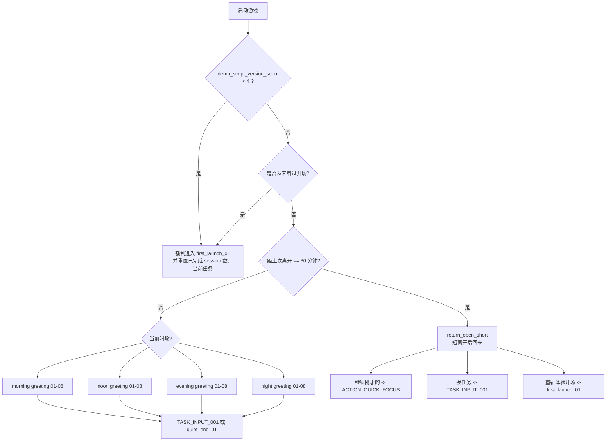

### 当前入口触发条件

- **版本升级首次启动**：`demo_script_version_seen < DEMO_SCRIPT_VERSION`，当前版本是 `4`。
- **真正第一次启动**：`has_seen_intro == false`。
- **短时回流**：距离上次离开不超过 `30 分钟` 时，进入 `return_open_short`。
- **普通回流**：否则按现实时间进入早 / 中 / 晚 / 夜问候节点。

## 3. 主线：目前真正存在的“剧情推进”

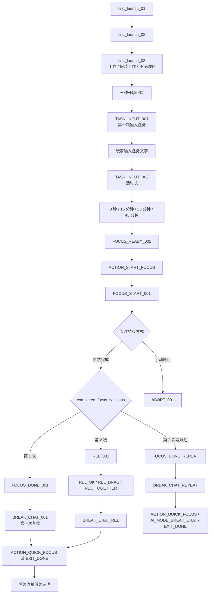

### 目前的主线层级

1. **第一次完成 session**：她第一次承认“你来了之后，我也真的做了点事”。
2. **第二次完成 session**：进入 `REL_001`，第一次明确把“有人一起做事会不一样”说出来。
3. **第三次以后**：目前没有新剧情，只进入重复完成节点 `FOCUS_DONE_REPEAT`。

### 这意味着什么

当前 demo **还没有真正展开主线**。  
它只有：

- 开场建立关系
- 第一次共同行动后的轻微靠近
- 第二次共同行动后的第一次关系确认

从第 3 次 session 开始，已经回到“循环玩法文案”，还没进入更深的故事推进。

## 4. “之后不用再报任务”的当前实现

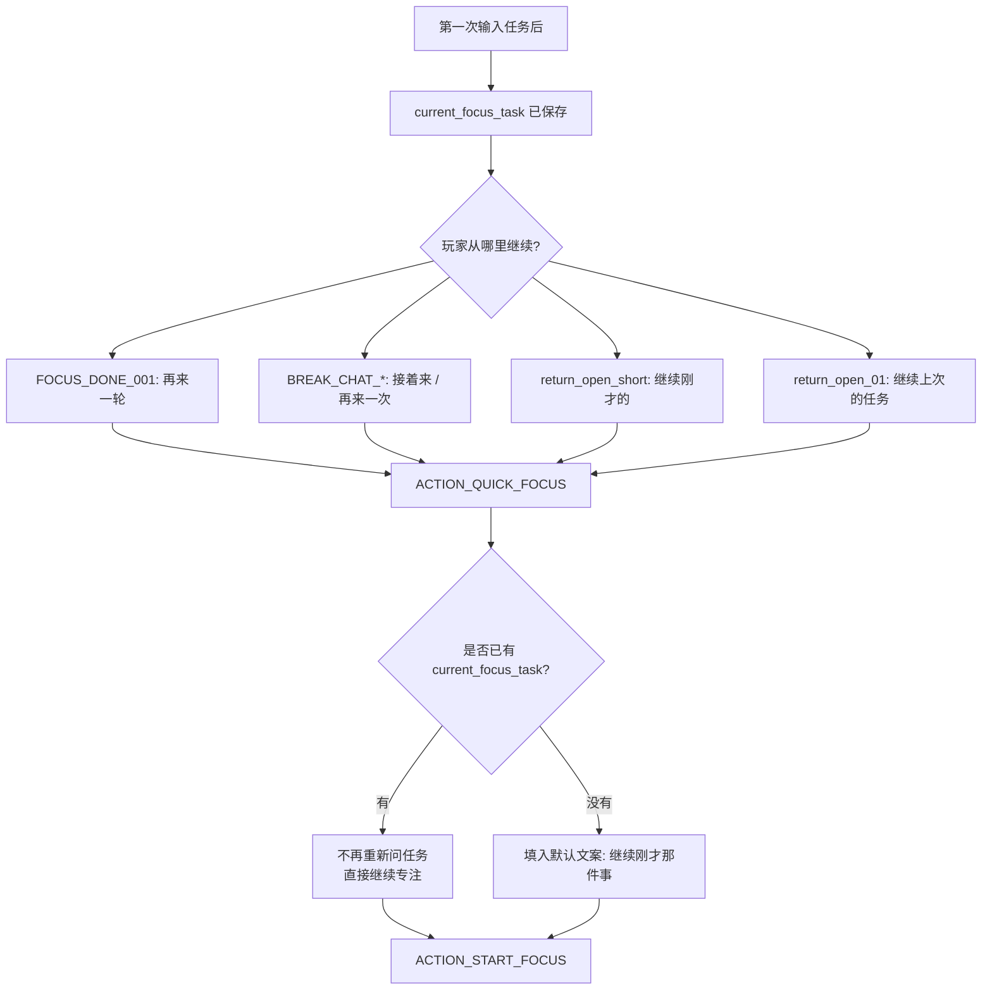

### 这里的设计意图

- **第一次**需要输入任务，因为游戏要知道你这轮大概在做什么。
- **之后**不该每轮都像老师点名，所以通过 `ACTION_QUICK_FOCUS` 直接回到专注。
- 目前这个规则已经接上了，但还没有做得很“生活化”：  
  她现在只是说一句“那就不重新报任务了，我们继续做自己的事”，以后还可以更自然。

## 5. 专注中戳 Yua 的反应线

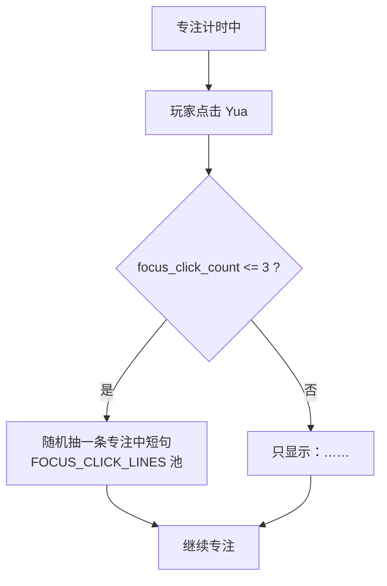

### 当前触发规则

- 只在 `focus_running == true` 时生效。
- 每轮专注中：
  - 前 `3` 次点击：从 `FOCUS_CLICK_LINES` 里随机抽一句。
  - 第 `4` 次起：她不再聊天，只回 `……`。

### 这条线的功能

- 它不是主线。
- 它是“陪伴感”和“轻微克制”的反馈层。
- 它也在系统层面防止玩家把专注时段变成聊天时段。

## 6. 玩家输入 / Type Mode 相关分支

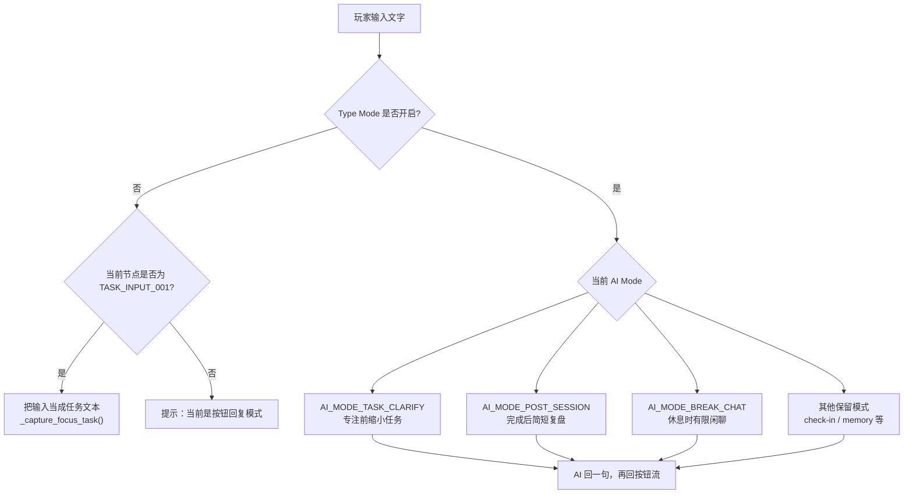

### 当前真正接入到脚本里的 Type Mode 入口

- `TASK_INPUT_001`
  - 按钮：`帮我把任务缩小一点`
  - 进入 `AI_MODE_TASK_CLARIFY`
- `BREAK_CHAT_001`
  - 按钮：`我想自己说`
  - 进入 `AI_MODE_POST_SESSION`
- `BREAK_CHAT_REL`
  - 按钮：`我想自己说几句`
  - 进入 `AI_MODE_POST_SESSION`
- `FOCUS_DONE_REPEAT`
  - 按钮：`自己说几句`
  - 进入 `AI_MODE_POST_SESSION`
- `BREAK_CHAT_REPEAT`
  - 按钮：`自己说几句`
  - 进入 `AI_MODE_BREAK_CHAT`
- `ABORT_REST`
  - 按钮：`聊一会儿`
  - 进入 `AI_MODE_BREAK_CHAT`

### 当前没真正成为剧情推进器的 AI

- AI 现在只是**侧枝**：
  - 任务澄清
  - 完成后反思
  - 休息时有限聊天
- 它**不会**：
  - 解锁主线
  - 替代剧情节点
  - 在专注前无限闲聊

这点目前是符合项目方向的。

## 7. 中断 / 离开 / 回流线

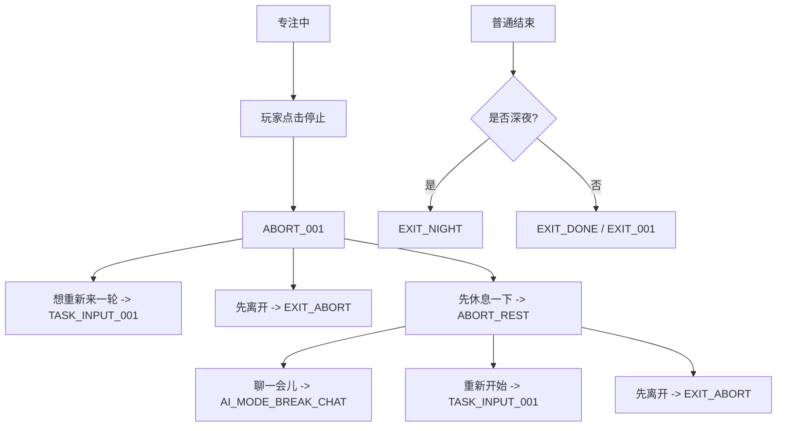

### 当前触发规则

- **中断专注**：只有计时器正在跑时按停止，才进入 `ABORT_001`。
- **夜间离开**：离开逻辑里会额外判断当前是否夜间，夜里会优先走 `EXIT_NIGHT`。
- **回流**：见上面的入口分流图。

## 8. 用一句话总结当前结构

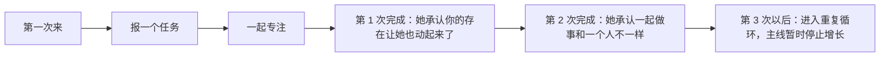

## 9. 当前结构最明显的问题

1. **主线太薄**  
   第 2 次完成之后，故事就没有继续长了。

2. **开场分支有，但没有带来后续性格化回响**  
   “工作 / 假装工作 / 还没想好”现在只影响当下几句，不会在后面形成记忆感。

3. **Type Mode 已经有位置，但还没有和角色关系形成很聪明的互文**  
   现在它只是功能性插口，还没有成为“她为什么会记住你某些事”的叙事工具。

4. **Poke 线很完整，但它目前只是气氛层**  
   它还没和关系阶段、任务类型、专注次数发生联动。

5. **重复循环比剧情更成熟**  
   从系统角度已经很像一个 focus companion；从“想让玩家继续回来是为了见她”的角度，钩子还不够强。

## 10. 带具体台词的主线图

### 10.1 开场到第一次专注

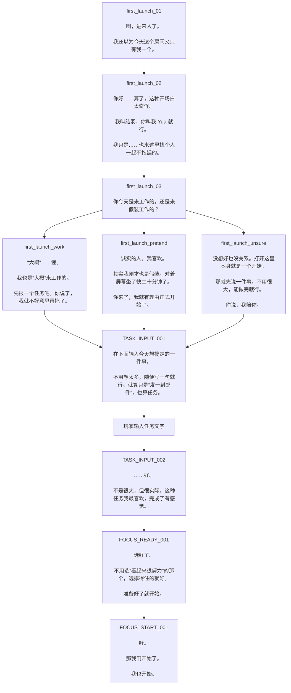

### 10.2 第一次完成后的分支

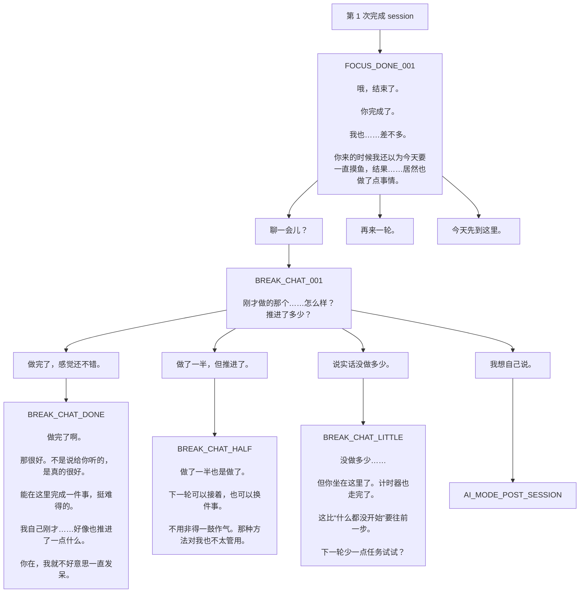

### 10.3 第二次完成后的分支

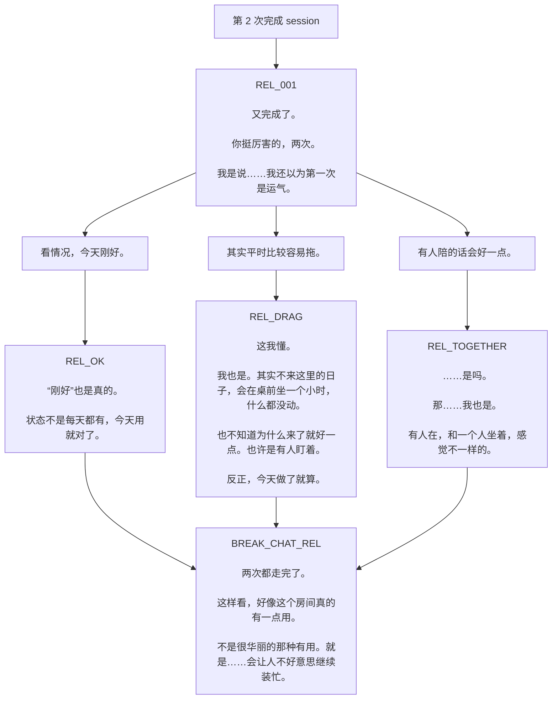

### 10.4 第三次及以后

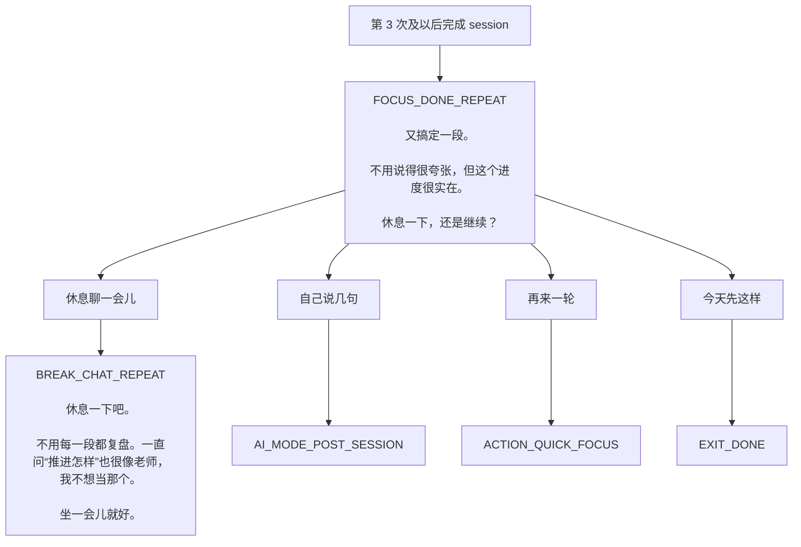

## 11. 带具体台词的“以后不再报任务”线

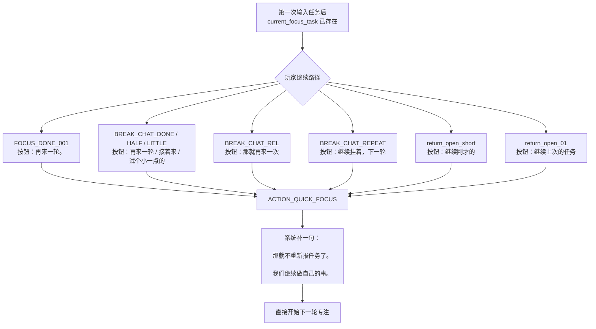

## 12. 入口 / 回流节点的具体台词

### 12.1 短时离开后回来

| 节点 | 触发条件 | 台词 |
| --- | --- | --- |
| `return_open_short` | 距上次离开不超过 30 分钟 | 哦，你回来了。  那边有事处理完了？  任务还没跑远。 |

### 12.2 普通回流

| 节点 | 触发条件 | 台词 |
| --- | --- | --- |
| `return_open_01` | 非首次进入、非短时回流、没有匹配到时段问候时的兜底 | 回来了。  ……我也还在。也不是一直在，就是……来来去去。  不用解释去哪里了。重新开始就好。 |

### 12.3 早晨 greeting 池

| 节点 | 台词 |
| --- | --- |
| `greeting_morning_01` | 早。  今天比昨天来得早一点。 |
| `greeting_morning_02` | 早上好。  睡够了吗……我反正没有。 |
| `greeting_morning_03` | 哦，这么早。  是被什么驱动了吗？ |
| `greeting_morning_04` | 早晨状态好的时候，真的要抓住。  来吧。 |
| `greeting_morning_05` | 你来了，我刚泡好水。  正好。 |
| `greeting_morning_06` | 早安。  今天先从一件小事开始？ |
| `greeting_morning_07` | 这个时间点来，说明你是认真的。  还是说只是睡不着。 |
| `greeting_morning_08` | 好，早上。  该开始了。你先说任务。 |

### 12.4 中午 greeting 池

| 节点 | 台词 |
| --- | --- |
| `greeting_noon_01` | 午后的困劲儿来之前，先做一块？ |
| `greeting_noon_02` | 刚吃完饭？  那十五分钟刚好，不用撑太久。 |
| `greeting_noon_03` | 中午来的人……  是上午没做完，还是下午想提前开工？ |
| `greeting_noon_04` | 这个时间点我也在。  今天不想一个人坐着。 |
| `greeting_noon_05` | 你好你好。  中午还在挣扎是吗。我也是。 |
| `greeting_noon_06` | 饭后困意高峰期。  但来都来了。 |
| `greeting_noon_07` | 午休没睡着就来工作。  是个好选择。大概。 |
| `greeting_noon_08` | 中午了，要做什么？  简单说一下。 |

### 12.5 傍晚 greeting 池

| 节点 | 台词 |
| --- | --- |
| `greeting_evening_01` | 傍晚来的……  是白天没搞完的收尾？ |
| `greeting_evening_02` | 这个时间点挺好的。  再做一段，今天就稳了。 |
| `greeting_evening_03` | 下班之后来的？  那今天这是额外的。 |
| `greeting_evening_04` | 傍晚气氛挺适合安静工作的。  不知道为什么。 |
| `greeting_evening_05` | 你来了。  今天还有什么没搞定的？ |
| `greeting_evening_06` | 晚饭前能做完一件事，晚上就可以放心摸鱼。 |
| `greeting_evening_07` | 傍晚了，时间不多，但够用。  说一件事。 |
| `greeting_evening_08` | 嗯，来了。  先把任务说出来，就会好一点。 |

### 12.6 夜间 greeting 池

| 节点 | 台词 |
| --- | --- |
| `greeting_night_01` | 晚上了，这个时间……  能撑多久？ |
| `greeting_night_02` | 夜班人来了。  也好，有人陪。 |
| `greeting_night_03` | 现在来，是还有事没做完，还是白天没能开始？ |
| `greeting_night_04` | 夜里做事有一种奇怪的专注。  反正我是这样。 |
| `greeting_night_05` | 挺晚了。  不用订太大的目标，搞一件就好。 |
| `greeting_night_06` | 你来了，我也刚坐下来不久。 |
| `greeting_night_07` | 今晚打算做什么？  说来听听。 |
| `greeting_night_08` | 夜里挺安静的。  我喜欢这种安静。你呢？ |

## 13. 专注中点击 Yua 的全部当前台词

### 触发条件

- 只在专注计时中触发。
- 每轮前 3 次点击，随机抽下面一句。
- 第 4 次开始，固定只显示：`……`

### 当前 `FOCUS_CLICK_LINES` 池

1. 还差一会儿，再撑一下。
2. 我也在。
3. 别看我，去看你的屏幕。
4. ……你是分心了还是确认我在？好，我在。
5. 快了快了，时间真的在走的。
6. 先别想别的事，那个等一会儿再说。
7. 中间分心是正常的，回来就行。
8. 不用做完，先往前推一点。
9. 我假装没看见你点我。你继续。
10. 来都来了，再做一小块。
11. 比你想象中过得快的，我保证。
12. 就算开始发呆了，也算在状态里。
13. 手边那件事，先做一步。
14. 好的，我知道你需要一点陪伴。行，但你还是要继续。
15. 计时器没停，你也别停。
16. 就快了，别现在放弃。
17. 坐着不动也行，但眼睛看屏幕。
18. 你刚才肯定想到别的事了。放一边，等计时器响。
19. 很好，你还在。
20. 这一段搞完，后面就轻松了。
21. 不需要状态很好，动着就行。
22. 时间还有，但也不多了。刚好。
23. ……点我干嘛。算了，你继续吧。

## 14. 玩家输入 / Type Mode 的具体入口

| 所在节点 | 触发按钮 | 进入模式 | 目前功能 |
| --- | --- | --- | --- |
| `TASK_INPUT_001` | 帮我把任务缩小一点 | `AI_MODE_TASK_CLARIFY` | 帮玩家把模糊任务缩成一个具体下一步 |
| `BREAK_CHAT_001` | 我想自己说 | `AI_MODE_POST_SESSION` | 玩家自由说这轮做得怎么样 |
| `BREAK_CHAT_REL` | 我想自己说几句 | `AI_MODE_POST_SESSION` | 第二次完成后的自由复盘 |
| `FOCUS_DONE_REPEAT` | 自己说几句 | `AI_MODE_POST_SESSION` | 重复 loop 中的简短反思 |
| `BREAK_CHAT_REPEAT` | 自己说几句 | `AI_MODE_BREAK_CHAT` | 已经 earned 的休息聊天 |
| `ABORT_REST` | 聊一会儿 | `AI_MODE_BREAK_CHAT` | 中断后，允许一点有限闲聊 |

### Type Mode 开启时，系统固定提示

> Type Mode 开着。你可以用自己的话写。

### 当前 AI 各模式的叙事边界

| 模式 | 边界 |
| --- | --- |
| `AI_MODE_TASK_CLARIFY` | 只做任务缩小，不延展闲聊，尽快回到开计时器 |
| `AI_MODE_POST_SESSION` | 只做短复盘，不解锁剧情，不突然加深关系 |
| `AI_MODE_BREAK_CHAT` | 只在已赚到的休息时间里轻聊，保持可退出 |
| `AI_MODE_CHECKIN` | 预留模式，当前不是主脚本核心入口 |
| `AI_MODE_MEMORY_FOLLOWUP` | 预留模式，当前还没真正和主线结合 |

## 15. 中断 / 离开节点的具体台词

| 节点 | 触发条件 | 台词 |
| --- | --- | --- |
| `ABORT_001` | 专注中按停止 | 停了？  没事。  计时器停了，不代表什么别的。  就是停了而已。 |
| `ABORT_REST` | 在 `ABORT_001` 选择“先休息一下，再说。” | 没事，先放着。  可以聊一会儿，也可以就静一静。  我也在。 |
| `EXIT_001` | 安静坐一会儿后离开 | 好，先这样吧。  下次来的时候，任务可以接着说。  ……我应该还在的。 |
| `EXIT_DONE` | 正常结束 | 好，今天到这里。  完成了一件事，很踏实吧。  下次见。 |
| `EXIT_ABORT` | 中断后离开 | 去吧。  断掉的是计时器，不是你。  下次回来，我们继续。 |
| `EXIT_NIGHT` | 夜间结束 | 挺晚了。  今天能做的做了，剩下的明天再说。  早点睡。  我也……差不多要关了。 |
| `quiet_end_01` | 在 greeting / return 里选择先坐一会儿 | 嗯。那就先静一会儿。  我在这边，不吵你。 |

## 16. 如果按“玩家实际体验顺序”读，当前脚本是这样

1. 她先注意到有人进来了。
2. 她笨拙地自我介绍，说自己也是来找人一起不拖延的。
3. 她问你今天是真工作，还是假装工作。
4. 不管怎么选，最后都会引到第一次任务输入。
5. 你输入任务，选时长，然后一起开始。
6. 第一轮结束后，她第一次承认：你来了，让她也真的做了点事。
7. 如果你聊，她会问你推进得怎样。
8. 第二轮结束后，她第一次把“有人陪会好一点”这件事说出口。
9. 第三轮以后，关系没有继续明显推进，进入稳定陪伴循环。
10. 专注中你可以戳她，但她会克制地把你推回任务上。
11. 你可以在少数节点切到 Type Mode，自由说一句，但 AI 不接管主线。

## 17. 现在这份脚本读下来，最值得注意的节奏事实

1. **最有“角色关系开始发生”的句子，其实集中在 3 处**
   - “你来了，我就有理由正式开始了。”
   - “你在，我就不好意思一直发呆。”
   - “有人在，和一个人坐着，感觉不一样的。”

2. **第一次 completion 的情绪回报比开场更有魅力**
   - 开场还在“产品 onboarding”附近。
   - 第一次完成后，她才开始比较像一个值得继续见的人。

3. **第二次 completion 已经把关系说得有点太直了**
   - `REL_TOGETHER` 很甜，但如果这是第二轮就说到这里，后面会比较难继续升级。
   - 也就是说：**它有效，但有点早花掉了一张好牌。**

4. **第三次以后断崖式回到功能循环**
   - 这就是现在你会觉得“怎么没有推进”的根本原因。

5. **当前最成熟的其实是她在专注中被点时的声音**
   - 那 23 条 poke line 反而最接近一个“有点可爱、有点熟、有点会逗你”的 Yua。
   - 如果要重写整体 tone，那一组可以当作比较好的内部参照物。
