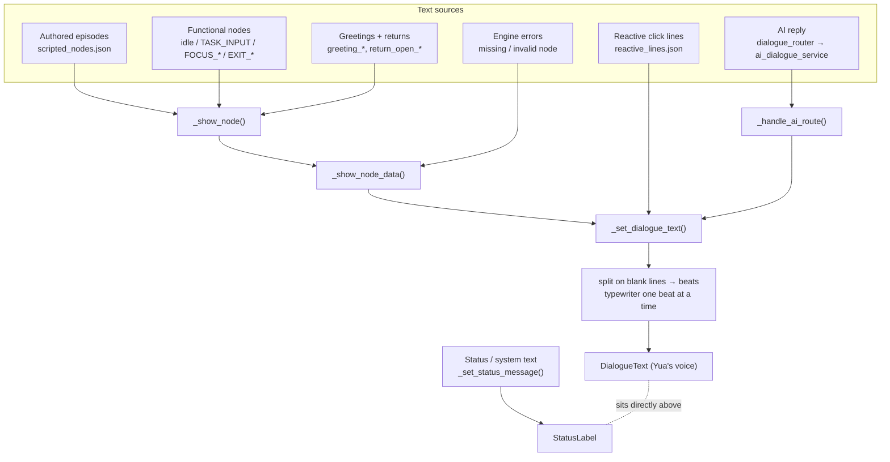

# Dialogue Flow Map (as-built)

How a line of dialogue actually gets chosen and displayed, traced from the code on
2026-08-19. This is the *as-built* map, not the intended design — where the two
differed, the difference was a bug, and the fixes are noted inline.

Companion docs: `docs/Architecture_Overview.md` (layers), `AGENTS.md` (rules).

---

## 1. There is one dialogue box and many things that write to it



**The key hazard:** `DialogueText` and `StatusLabel` sit in the same visual strip
(dialogue card at `offset_top -278`, status at `-112`), both centred. A player
cannot tell them apart, so *anything* in the status label reads as Yua speaking.
That is why status strings must be neutral and third-person — see §5.

---

## 2. What decides the first line of a session

`_ready()` deliberately lands on `idle` and does **not** auto-open dialogue
(`main_scene.gd:189-196`). The opener resolves on the **first click of Yua**:

`_on_character_clicked()` (`main_scene.gd:1018+`) in priority order:

| # | Condition | Result |
|---|---|---|
| 1 | `focus_running` | reactive `focus_click` line (`……` inside a 180s cooldown) |
| 2 | typewriter still running | finish revealing the current beat |
| 3 | more beats pending | advance one beat |
| 4 | `current_node_id == "idle"` **or** no choices on screen | re-open the conversation ↓ |
| 5 | exactly 1 choice | take it (keeps 1-choice intro nodes responsive) |
| 6 | multiple choices | leave them standing (no dead-end) |

Inside #4, `_conversation_opened_this_session` decides:
- **already opened** → `_show_idle_click_line()` — a short presence line, no story movement.
- **first time** → `_resolve_start_node_id()`:

```
not _intro_already_seen()      → intro_node (ep00_01)   [+ save immediately]
returning, gap ≤ 30 min        → return_open_short
returning, hour in a bucket    → greeting_{morning|noon|evening|night}_0N (random)
returning, otherwise           → return_open_01
```

`_pick_time_greeting_node_id()` returns `""` for hours 14–17 and 02–06, which is
why those windows fall through to `return_open_01`.

---

## 3. What advances the story

**Only completed focus sessions.** `_show_focus_complete_node()`
(`main_scene.gd:1648+`) asks `ProgressionGate.select_focus_complete_node()`, which:

1. refuses everything while `intro_seen` is false,
2. sorts episodes by `session_gate`,
3. returns the lowest-gate episode whose `seen_flag` is unset, whose
   `completed_focus_count` is met, and whose `unlock` is satisfied
   (`total_focus_seconds_min` is what stops a 3-second test session speed-running
   intimacy beats),
4. falls back to `FOCUS_DONE_REPEAT` when nothing is eligible.

Clicks, Type Mode and idling never call this. That matches `AGENTS.md`.

---

## 4. Bugs found and fixed (2026-08-19)

All were invisible to the test suite, which was fully green while the game
misbehaved. Each now has a scenario that fails without the fix.

### 4.1 Ep0 replayed after it had been seen — `tools/godot_check/scenarios/ep0_once.gd`

**Two sources of truth disagreed.** "Has the intro been seen?" was stored both as
the save field `has_seen_intro` *and* as the story flag `intro_seen` that
`ep00_close` writes via `set_flags`.

The race: on the first click, `_note_meaningful_interaction()` saves the profile
**before** `_resolve_start_node_id()` flips `has_seen_intro = true` in memory.
Later, `ep00_close`'s `set_flags` calls `set_story_flag()`, which saves the profile
again — writing back the *stale* `has_seen_intro: false`. The result is a save that
says "intro seen" (flag) and "intro not seen" (field) simultaneously. Next launch,
`_resolve_start_node_id` reads only the field and replays `ep00_01`.

A second route: `_debug_timeline_jump()` set `has_seen_intro = false` and showed a
node without spending `_conversation_opened_this_session`, so the next Yua click
re-resolved an opener and restarted the intro **mid-session**.

**Fixes** — `_intro_already_seen()` now consults *both* sources (mirroring
`_build_progression_state`), used at both entry points; `has_seen_intro = true` is
persisted immediately; the debug jumper moves both sources together and marks the
opener spent.

### 4.2 System / operator English spoken as Yua — `tools/godot_check/scenarios/text_sources.gd`

Five separate leaks, all reproduced then fixed:

| Leak | Root cause | Fix |
|---|---|---|
| Provider failure spoke English | `dialogue_router.gd` compared the reply against `"AI provider is not available."` — a string that **exists nowhere in the codebase**. The service actually returns `FALLBACK_REPLY` ("Mm. I can't reach the AI right now…") on *all 8* failure paths, so the guard never matched and the English went to the box. | A failed call now **always** uses `AI_FALLBACK_TEXT`; raw provider text is kept under `error_text` for diagnostics only. |
| Empty reply spoke English | `ai_dialogue_service` returned `success: true, fallback_used: false` while substituting English `FALLBACK_REPLY`, so nothing downstream could tell. | Empty content now returns `success: false`; the router covers it in-voice. |
| Raw chain-of-thought printed | `_strip_reasoning` guarded on the **opening** `<think>` tag, but MiniMax M-series often send it as part of the chat template and echo back only `…reasoning…</think>reply`. | Everything before the **last** closing tag is dropped, with case and `thinking`/`reasoning`/`thought` variants covered. |
| Memory follow-ups in English | Four hard-coded English lines in `memory_manager._follow_up_line_for_tag`, spoken directly as Yua, plus English choice chips. | Rewritten as authored Mandarin in her voice. |
| `"Dialogue error: …"` in her voice | `_make_missing_node` / `make_transition_error_node` / `_show_node_data` printed developer English into the dialogue box. | Player sees an in-fiction cover line; the real ids go to the console via `push_warning`. |

Also fixed while here:
- **"Back to safety" could loop forever** — the recovery choice failed
  `validate_choice_transition` against the error node itself, producing another
  error node with the same choice. It is now `internal_return`, which bypasses
  validation.
- **Bogus missing-node warnings on every UI refresh** — `_current_node_has_tag`
  called `get_dialogue_node()` (which *synthesizes* an error node) instead of
  checking `has_dialogue_node()` first.

### 4.3 Stale text removed

`FOCUS_COMPLETE_LINE`, `FOCUS_START_LINE`, `FOCUS_STOP_LINE`, `FOCUS_SET_LINE`,
`DEFAULT_RETURN_CHOICE_TEXT`, and three `*_PLACEHOLDER_TEXT` constants: all English,
several written in Yua's **first person**, and shown in the status strip directly
under her line. Deleted; status text now comes from `_ui_text("status_*")` and is
neutral in both languages.

`DEFAULT_RETURN_CHOICE_TEXT` also injected an English chip pointing at
`greeting_01` — **a node id that does not exist in the script**. That whole branch
was dead and is gone.

---

## 5. Rules to keep this from regressing

1. **The dialogue box is Yua's voice only.** Authored lines, reactive pools, or a
   validated AI reply. Nothing else.
2. **The status strip is neutral and third-person.** It sits under her line and
   reads as her if written in the first person.
3. **Operator/provider text never reaches the player.** Log it; show an in-fiction
   cover line.
4. **One question, one source of truth.** 4.1 happened because "has the intro been
   seen" had two. If a second must exist, reconcile it in one helper that every
   caller uses.
5. **Reproduce before fixing.** The suite was green through every bug above.

---

## 6. Known gaps (not fixed here)

- **`current_ai_mode_id` / `AI_MODE_*` may now be dead.** Type Mode is always-on
  since the toggle was removed (`ai_mode_toggle` is hard-coded `null`), so
  "entering AI mode" may no longer be a real state. `_handle_ai_mode_choice` is
  only reachable from a choice whose `next` starts with `AI_MODE_`, and no node in
  the current script has one. **Needs an owner decision** on what leaving/entering
  free chat should mean before deleting — see the AI↔scripted question below.
- **AI ↔ scripted transition is still undesigned.** Typed text routes to the AI from
  wherever the player is; there is no defined notion of "return to the story". The
  scripted position is simply whatever `current_node_id` was.
- **UI chrome is still English** ("Song: No track loaded", "Play", "Tasks", "Send",
  "Focus Timer"), and `ui_language` defaults to `"en"`. This is the known B4/B5
  task in `Progress.md`, not a dialogue-flow bug.
- **Dead code left in place:** `_speak_companion_line()`, `_show_todo_status()`,
  `memory_manager.get_memory_context()` — all zero callers.
- `_build_follow_up_choices` still probes `greeting_01` first; harmless because it
  falls through to `return_open_01`, but the id is fictional.
